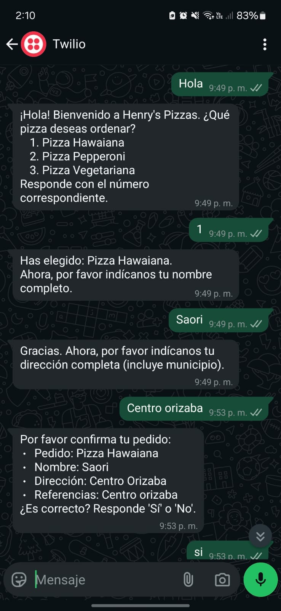
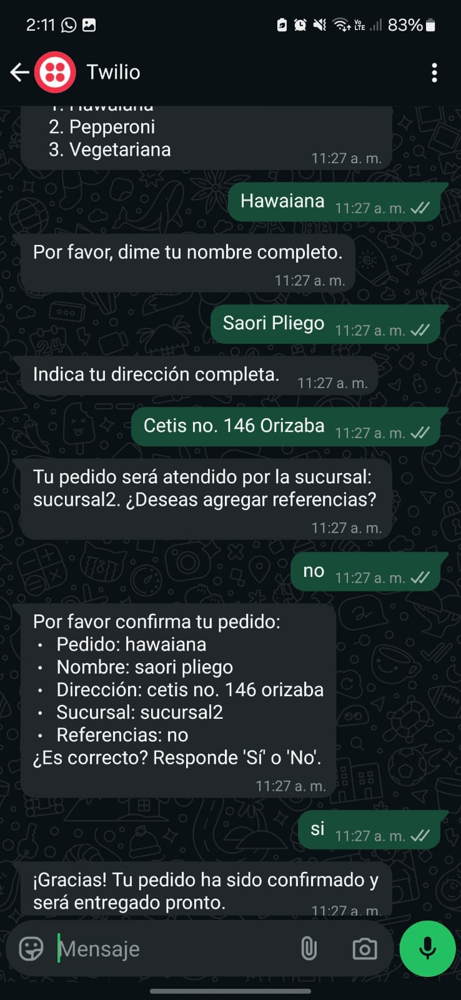
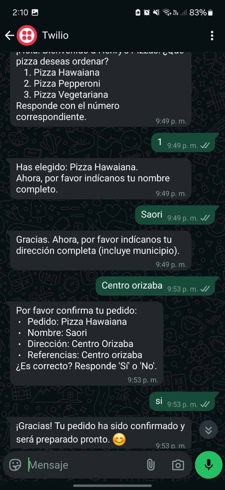

# 🤖 ChatBot de Pedidos por WhatsApp

Este es un chatbot hecho en Python usando **Flask**, que permite pedir pizzas por **WhatsApp**. El bot guarda los pedidos en **Firebase**, obtiene direcciones con **Google Maps**, y responde usando **Twilio**.

---

## 📷 Imágenes del proyecto

### Inicio de conversación


### Confirmación del pedido


### Asignación de sucursal


---

## 🚀 ¿Qué hace?

- Recibe pedidos por WhatsApp.
- Pide nombre, dirección y referencias.
- Asigna la sucursal más cercana con mapas.
- Guarda los pedidos en Firebase.
- Responde automáticamente paso a paso.

---

## 🧪 Rutas principales

| Ruta       | Método | Función                                 |
|------------|--------|------------------------------------------|
| `/test`    | GET    | Verifica si Flask funciona               |
| `/whatsapp`| POST   | Ruta para recibir mensajes de WhatsApp   |

---

## ⚙️ ¿Qué necesitas?

1. Cuenta de **Twilio** con acceso a WhatsApp.
2. Cuenta de **Firebase** con Realtime Database.
3. Una **API Key** de **Google Maps**.

Configura las variables de entorno en un archivo `.env`.

---

## ▶️ Cómo correrlo

```bash
git clone https://github.com/SaoriPLh/flask-chatbot
cd flask-chatbot
pip install -r requirements.txt
python app.py
